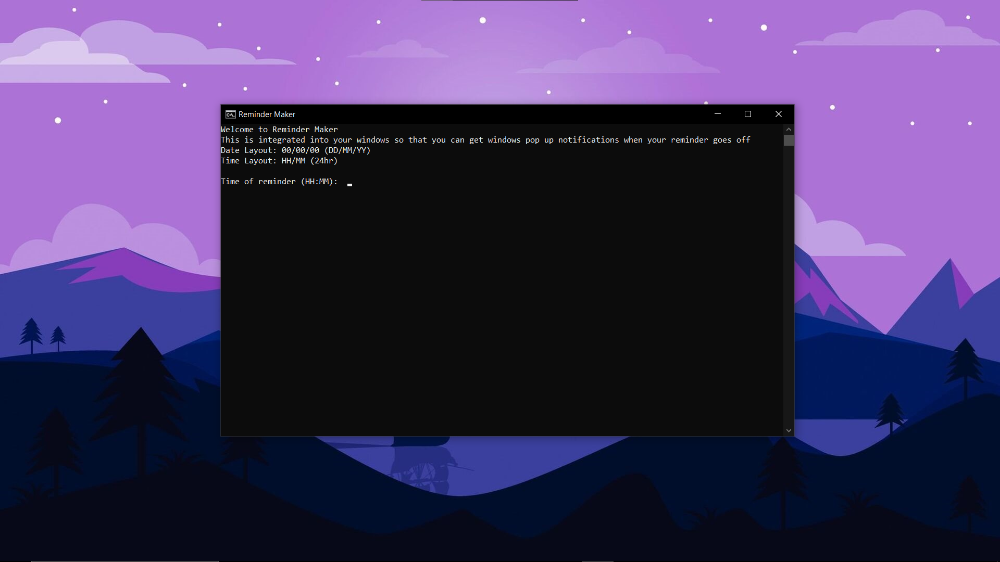
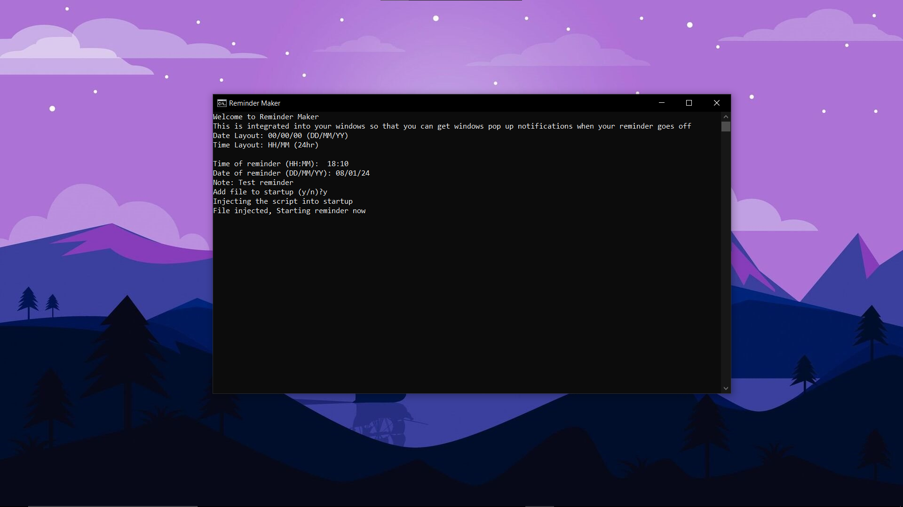
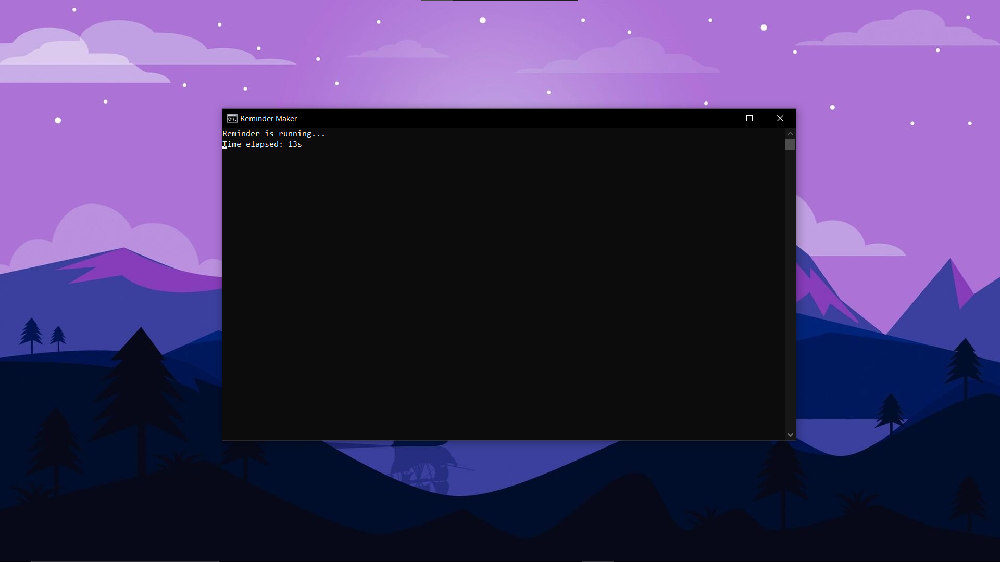
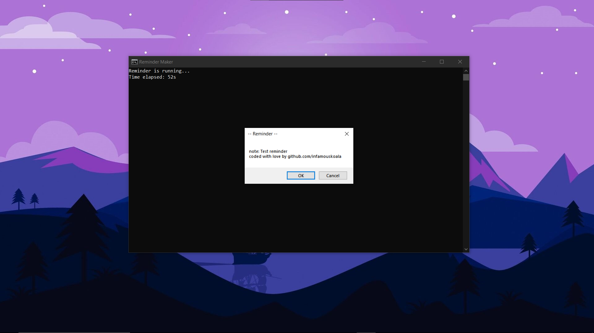
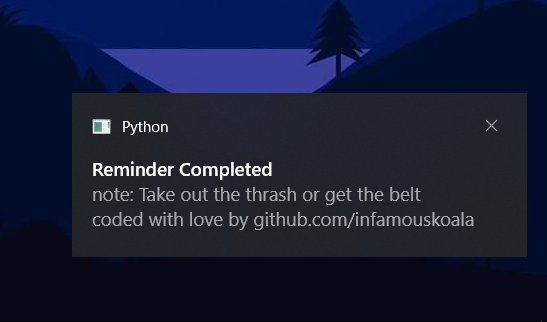

# Smart Reminder
- This project is a reminder app with a note and a windows notification pop up and start on windows startup feature. Also comes with a reset file to remove the startup file.
- Notification sound is customisable, you can save your own sound with the name `notification.mp3` and delete the already existing notification sound.

# Installation & Uninstallation
- Download the zip and extract the files.
- Manually install requirements using `pip install -r requirements.txt` and then run `main.py` or run the `run.bat` file.
- If you wish to remove the file off your startup menu, you can either manually delete the file or use `reset.bat`. The path of the file is: `C:\Users\{YOURUSERNAME}\AppData\Roaming\Microsoft\Windows\Start Menu\Programs\Startup\timer.bat`

# Preview

